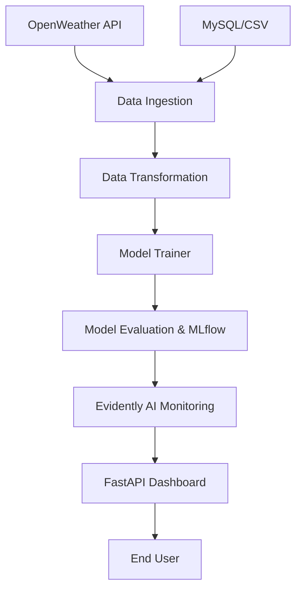

# 🌦️ WeatherPro AI: Industrial-Grade Weather Forecasting System


WeatherPro AI is a modular, production-ready machine learning pipeline and forecasting system. It combines real-time weather data from global APIs with a custom-trained **RandomForest** model to provide "Smart Forecasts" and 5-day weather visualizations.

## 🚀 Key Features

*   **Modular ML Pipeline**: Fully decoupled stages for Ingestion, Transformation, Training, and Evaluation.
*   **Hybrid Intelligence**: Merges real-world measurement data with AI-driven trend predictions.
*   **Premium Dashboard**: A stunning, glassmorphic UI built with FastAPI and Jinja2.
*   **Data Drift Monitoring**: Integrated **Evidently AI** to monitor model performance and data consistency over time.
*   **MLflow Integration**: Experiment tracking and model registry for industrial-grade version control.
*   **CI/CD Ready**: Configured for GitHub Actions and Dockerized for AWS deployment.

## 🏗️ Project Architecture



## 🛠️ Tech Stack

*   **Core**: Python 3.10+, FastAPI
*   **Machine Learning**: Scikit-Learn, Pandas, NumPy
*   **Ops & Monitoring**: MLflow, DVC, Evidently AI
*   **Database**: MySQL / SQLAlchemy
*   **Containerization**: Docker
*   **Frontend**: HTML5, Vanilla CSS (Glassmorphism), Jinja2

## 🚦 Getting Started

### 1. Clone the repository
```bash
git clone https://github.com/AhtishamIjaz/weather_pro.git
cd weather_pro
```

### 2. Setup Environment
Create a `.env` file in the root directory:
```env
WEATHER_API_KEY=your_openweathermap_api_key
MLFLOW_TRACKING_URI=your_mlflow_uri
MYSQL_HOST=localhost
...
```

### 3. Install Dependencies
```bash
pip install -r requirements.txt
```

### 4. Run the Pipeline
To train the model and generate metrics:
```bash
python main.py
```

### 5. Launch the Dashboard
```bash
python app.py
```
Visit `http://localhost:8000` to see the live system.

## 🐳 Docker Deployment
```bash
docker build -t weather_pro .
docker run -p 8000:8000 weather_pro
```

## 📊 Monitoring
Latest data drift reports can be found in the `reports/` directory. These are generated automatically to ensure the model remains accurate as weather patterns shift.

## 📄 License
Distributed under the MIT License. See `LICENSE` for more information.

---
**Developed with ❤️ for Production-Grade ML.**
